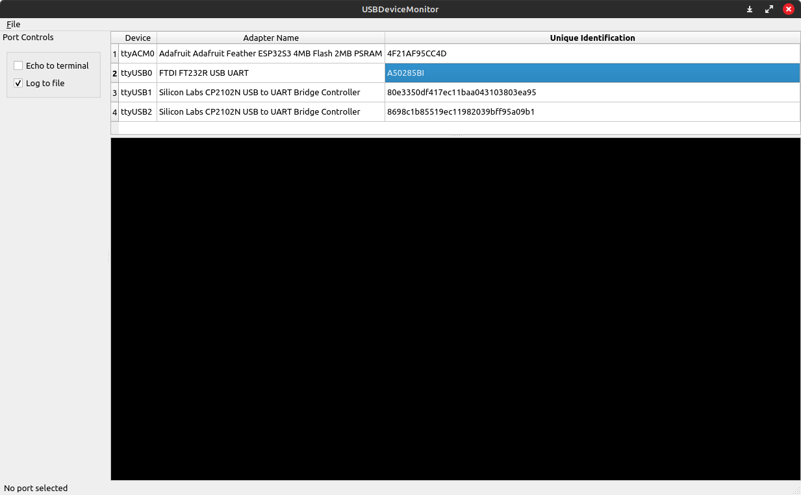

## USB Device Monitor (udm)
### Why
I created this utility because I have a need to keep track of the many embedded devices (i.e. IoT) I work with. They are all simultaniously attached to my Linux development system via USB, as each device has a USB-to-UART adapter. Some of my devices are programmed in C++ using Espressif's ESP-IDF toolset, some programmed with MicroPython, and some programmed with CircuitPython. But they all use USB to commincate with a development system.

I wanted a tool that would list them all, and present them in an ordered way. I also wanted to be able to communicate with them, and if possible, log any serial data (i.e. text) coming out of those ports.

It's not complete. But there's enough here to save. Over time it will evolve as my needs and understanding of what I want to do becomes clearer. I hope you find it of use in your work.
### Requirements to Build
0. Debian/Ubuntu based Linux operating system. I use Linux Mint 21.1.
1. cmake - Check the version in CmakeLists.txt and make sure you have a version that matches the minimum called for in the CMake file.
2. g++ - Version 11 or higher. You need to support the C++20 standard. This version of g++ is found in every contemporary Linux distribution, such as Linux Mint 21.1.
3. QT 6.2 LTS - Make sure the following libraries are installed (this is for Linux Mint 21.1)
    - qt6-base-dev
    - libqt6serialport6 (to support QSerial, not installed with qt6-base-dev)
    - libqt6serialport6-dev (to support QSerial, not installed with qt6-base-dev)
### How to Build
1. Check out this project folder somewhere in your home directory.
2. Step into the folder.
3. Run cmake: `cmake -B build .`. This will create a folder beneath your current location named `build`, into which the makefile and all other build files are created.
4. Run make: `make -C build`. This will build the application, leaving the executable binary in the `build` folder.
### Run the Application
Run the application: `./build/udm`

## License

    Copyright (c) 2023 William H. Beebe, Jr.

    Licensed under the Apache License, Version 2.0 (the "License");
    you may not use this file except in compliance with the License.
    You may obtain a copy of the License at

    http://www.apache.org/licenses/LICENSE-2.0

    Unless required by applicable law or agreed to in writing, software
    distributed under the License is distributed on an "AS IS" BASIS,
    WITHOUT WARRANTIES OR CONDITIONS OF ANY KIND, either express or implied.
    See the License for the specific language governing permissions and
    limitations under the License.